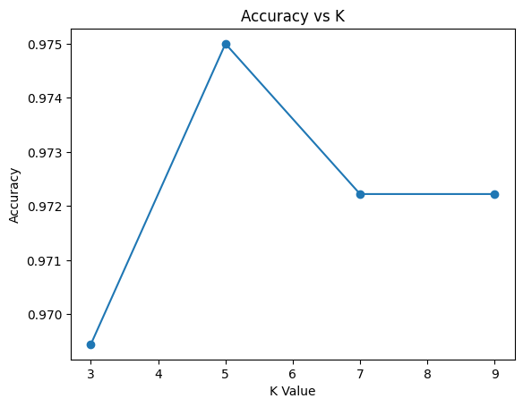
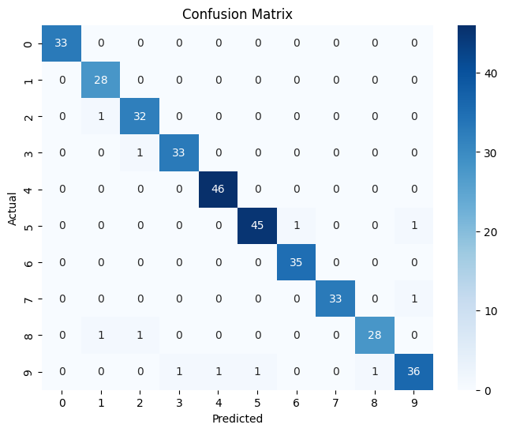

# Handwritten Digit Classification using KNN

This project demonstrates how the K-Nearest Neighbors (KNN) algorithm can be used to classify handwritten digits.  
The dataset used is the built-in digits dataset from scikit-learn, which contains small grayscale images of digits from 0 to 9.

The purpose of this project is to understand how a distance-based machine learning algorithm works and how different values of K affect model performance.

---

## Problem Description

Handwritten digit recognition is a classic machine learning problem.  
The goal is to take an image of a digit and correctly predict which number it represents.

Each image:
- Is of size 8×8 pixels  
- Is represented using 64 numerical values  
- Belongs to one of 10 classes (0–9)

This problem is commonly used to introduce classification algorithms.

---

## Approach

The project follows a complete machine learning workflow:

1. Data Loading  
   The digits dataset is loaded directly from scikit-learn.

2. Data Visualization  
   Sample images are displayed to understand how the digits look.

3. Train-Test Split  
   The dataset is split into training and testing sets to evaluate model performance on unseen data.

4. Feature Scaling  
   Since KNN relies on distance calculations, feature scaling is applied to ensure all pixel values are on the same scale.

5. Model Training  
   A KNN classifier is trained using different values of K.

6. Model Evaluation  
   Accuracy is calculated for each K value.

7. Performance Analysis  
   An accuracy vs K plot is created to choose the best K.

8. Confusion Matrix  
   A confusion matrix is generated to analyze classification errors.

9. Prediction Visualization  
   Test images are shown along with predicted labels.

---

## Why Feature Scaling is Required

KNN uses distance metrics such as Euclidean distance.  
If features are not scaled, some pixel values may dominate the distance calculation and lead to incorrect predictions.

Standardization ensures:
- All features contribute equally  
- Distance calculations become meaningful  
- Model accuracy improves  

---

## Results

The model achieves high accuracy in predicting handwritten digits.  
The accuracy vs K plot helps identify the best K value.  
The confusion matrix shows that most predictions lie on the diagonal, indicating correct classification.

## Visual Outputs

### Accuracy vs K

### Confusion Matrix

---

## Deliverables

This repository includes:

| File | Purpose |
|------|---------|
| KNN_Handwritten_Digits.ipynb | Full implementation with explanations |
| accuracy_vs_k.png | Accuracy vs K comparison plot |
| confusion_matrix.png | Confusion matrix visualization |
| README.md | Project documentation |

---

## Key Learning Outcomes

Through this project, the following concepts are demonstrated:

- Distance-based classification  
- Importance of feature scaling  
- Effect of hyperparameter K  
- Visual evaluation using plots  
- Understanding confusion matrix  

---

## Tools and Technologies

- Python  
- Scikit-learn  
- NumPy  
- Matplotlib  
- Seaborn  
- Google Colab  

---

This project provides a clear understanding of how KNN works in practice and serves as a foundation for more advanced image classification models.
